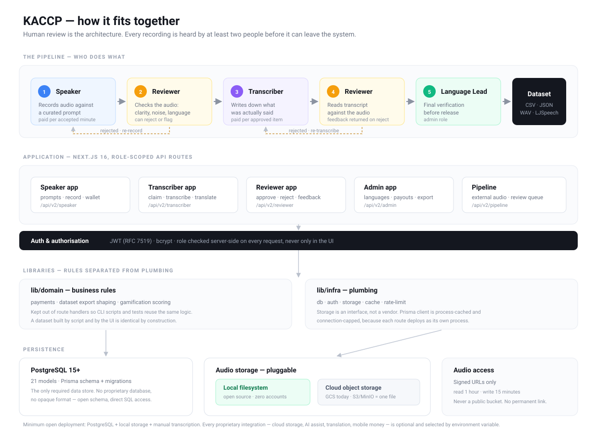

# Architecture

How KACCP is put together, for someone who needs to run it, extend it, or deploy it for a new
language.

---



## 1. What the system does

KACCP turns spoken language into a training dataset, through a pipeline of human work:

```
   Prompt bank                                        Dataset
        │                                                ▲
        ▼                                                │
   ┌─────────┐   ┌──────────┐   ┌─────────────┐   ┌──────────────┐
   │ SPEAKER │──▶│ REVIEWER │──▶│ TRANSCRIBER │──▶│   REVIEWER   │
   │ records │   │  checks  │   │   writes    │   │   approves   │
   │  audio  │   │  audio   │   │   what was  │   │     text     │
   └─────────┘   └──────────┘   │     said    │   └──────────────┘
                                └─────────────┘           │
                                                          ▼
                                                  ┌──────────────┐
                                                  │ LANGUAGE LEAD│
                                                  │   verifies   │
                                                  └──────────────┘
```

Each stage is a different person. **A recording is heard by at least two people before it can be
exported**, which is the core quality guarantee and the basis of the moderation policy.

---

## 2. Technology

| Layer | Choice | Notes |
|---|---|---|
| Framework | Next.js 16 (App Router) | Pages and API routes in one deployment |
| Language | TypeScript | |
| UI | React 19, Tailwind CSS | |
| Database | PostgreSQL 15+ | The only required data store |
| ORM | Prisma | Schema in `prisma/schema.prisma`, migrations in `prisma/migrations/` |
| Auth | JWT (RFC 7519), bcrypt | No third-party identity provider required |
| Storage | Pluggable | Local filesystem or Google Cloud Storage |
| i18n | next-intl | |

Everything required is open source. See [§7](#7-swapping-out-the-closed-parts).

---

## 3. Roles

Roles live on `User.roles` (an array — one person can hold several).

| Role | Can |
|---|---|
| `SPEAKER` | Record audio against prompts; see own earnings and wallet |
| `TRANSCRIBER` | Claim recordings; write transcriptions; correct pipeline items; write English translations |
| `REVIEWER` | Approve or reject audio and transcriptions; return feedback |
| `ADMIN` | Everything, plus prompts, languages, payouts, exports, user management |

**Language Lead** is an ADMIN working in the pipeline review screens — a workflow position rather
than a separate role.

Authorisation is enforced **server-side on every request** via `getAuthUser()`, not by hiding UI.

---

## 4. Data model

21 models. The ones that matter:

```
Country ──< Language ──< Prompt ──< Recording ──< Transcription
                │                       │
                │                       ├── TranscriptionAssignment   (claim lock)
                │                       └── ExportRecord              (export ledger)
                └──< WordBank

User ──< Recording        (as speaker)
     ──< Transcription    (as transcriber / as reviewer)
     ──< Payment, WalletTransaction

AudioSession ──< ReviewQueue ──< DatasetVersion      (external-audio pipeline)
```

### Recording lifecycle

```
PENDING_REVIEW ──▶ PENDING_TRANSCRIPTION ──▶ TRANSCRIBED ──▶ APPROVED ──▶ exportable
      │                                           │
      ├──▶ REJECTED   (audio unusable)            └──▶ REJECTED (bad transcription)
      └──▶ FLAGGED    (quality or content issue)
```

`REJECTED` and `FLAGGED` recordings are **excluded from exports by default** — enforced in the
export tooling, not left to the operator.

### Two sources of audio

KACCP handles two kinds of material, which is why some fields look duplicated:

1. **Prompt-driven recordings** (`Recording`) — a speaker reads or responds to a prompt. The
   prompt's `englishText` is the source sentence.
2. **External audio** (`AudioSession` → `ReviewQueue`) — audio captured elsewhere, e.g. real
   calls, needing correction of a machine transcript. No prompt, no English source.

The dataset export merges both, tagging each row with its provenance.

### Free-form prompts — a trap worth knowing

When `Prompt.isFreeForm` is true, `englishText` is an **instruction** ("Describe how to prepare
yams"), not a sentence the speaker translated. It is therefore *not* a valid English side for a
training pair. The English translation for those recordings lives in
`Recording.englishTranslation`, written by a transcriber. Exports drop free-form rows by default
for exactly this reason.

---

## 5. Request lifecycle

```
Browser
   │  Authorization: Bearer <JWT>
   ▼
Next.js API route  ──▶ getAuthUser()  ──▶ verify JWT ──▶ load user (cached 15s)
   │                                                      │
   │                                          role check (server-side)
   ▼
Prisma ──▶ PostgreSQL
   │
   └──▶ Storage provider ──▶ signed URL (read 1h / write 15m)
```

Audio is **never served from a public bucket**. Clients receive a short-lived signed URL scoped to
one object.

### Connection budget

Each API route deploys as its own serverless process, so the database budget is
`concurrent routes × connection_limit × instances`. The Prisma client is cached on `globalThis`
and `connection_limit` defaults to `1`; expensive aggregates are cached in-process. Behind a
server-side pooler (PgBouncer), raise `DB_CONNECTION_LIMIT`.

---

## 6. Directory layout

```
src/
  app/
    [locale]/           Pages, by role: speaker/ transcriber/ admin/
    api/
      auth/             register, login, password reset
      v2/
        speaker/        prompts, recordings, wallet
        transcriber/    available, claim, submit, english, profile
        reviewer/       audio and transcription review
        admin/          users, payouts, stats, export
        pipeline/       external-audio review queue, datasets
        leaderboard/    rankings
  components/
    gamification/       avatars, levels, badges, celebrations
  lib/
    domain/             business rules — payments, exports, gamification
    infra/              db, auth, storage, cache, rate-limit
prisma/
  schema.prisma         data model
  migrations/           schema history
scripts/                CLI tools: export, seeding, backfills
docs/                   this file and friends
```

**`lib/domain` holds rules; `lib/infra` holds plumbing.** Payment rates, export shaping and
gamification scoring are domain code, deliberately kept out of route handlers so they can be
tested and reused by CLI scripts.

---

## 7. Swapping out the closed parts

KACCP runs fully on open-source components. Every proprietary integration is optional and selected
by environment variable.

| Closed service | Role | Open path |
|---|---|---|
| Google Cloud Storage | Audio storage | `STORAGE_PROVIDER=local` uses the filesystem. The interface is `lib/infra/storage/provider.ts`; S3/MinIO needs one new provider file. |
| Orange Money | Payouts | Payments are database rows. Settle by any means and mark them paid. Not on the data-collection path. |
| OpenAI | Optional transcription assist | Omit `OPENAI_API_KEY` for a fully manual workflow. Any OpenAI-compatible endpoint works (vLLM, Ollama, LocalAI, self-hosted Whisper). |
| Google Translate / DeepL | Optional UI translation | `lib/translation-providers/` is pluggable; omit to disable. |
| UploadThing | Optional upload helper | Superseded by the storage abstraction. |

**Minimum open deployment:** PostgreSQL + local storage + manual transcription. Nothing else
required.

---

## 8. Adding a language

No code changes. See
[adapting-to-a-new-language.md](adapting-to-a-new-language.md) for the full walkthrough; in brief:

1. Create the `Country` (ISO 3166-1 alpha-2) and `Language` (ISO 639-3).
2. Set `speakerRatePerMinute` and `transcriberRatePerMin`.
3. Import a prompt bank from CSV.
4. Onboard speakers and transcribers with that language in `speaksLanguages` / `writesLanguages`.

---

**Related:** [Data dictionary](data-dictionary.md) · [Dataset export](krio-tts-dataset.md) ·
[Content moderation](content-moderation.md) · [Privacy](../PRIVACY.md)
